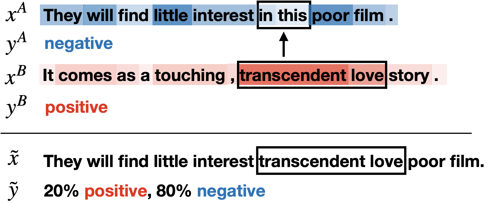

# SSMix: Saliency-based Span Mixup for Text Classification (Findings of ACL 2021)

Official PyTorch Implementation of SSMix | [Paper](https://arxiv.org/abs/2106.08062) 
* * *



## Abstract
Data augmentation with mixup has shown to be effective on various computer vision tasks. 
Despite its great success, there has been a hurdle to apply mixup to NLP tasks since text consists of discrete tokens with variable length. 
In this work, we propose *SSMix*, a novel mixup method where the operation is performed on input text rather than on hidden vectors like previous approaches. 
*SSMix* synthesizes a sentence while preserving the locality of two original texts by span-based mixing and keeping more tokens related to the prediction relying on saliency information. 
With extensive experiments, we empirically validate that our method outperforms hidden-level mixup methods on the wide range of text classification benchmarks, including textual entailment, sentiment classification, and question-type classification. 


## Code Structure
```
|__ augmentation/ --> augmentation methods by method type
    |__ __init__.py --> wrapper for all augmentation methods. Contains metric used for single & paired sentence tasks
    |__ saliency.py --> Calculates saliency by L2 norm gradient backpropagation
    |__ ssmix.py --> Output ssmix sentence with options such as no span and no saliency given two input sentence with additional information
    |__ unk.py --> Output randomly replaced unk sentence 
|__ read_data/ --> Module used for loading data
    |__ __init__.py --> wrapper function for getting data split by train and valid depending on dataset type
    |__  dataset.py --> Class to get NLU dataset
    |__ preprocess.py --> preprocessor that makes input, label, and accuracy metric depending on dataset type
|__ trainer.py --> Code that does actual training 
|__ run_train.py --> Load hyperparameter, initiate training, pipeline
|__ classifiation_model.py -> Augmented from huggingface modeling_bert.py. Define BERT architectures that can handle multiple inputs for Tmix
```
Part of code is modified from the [MixText](https://github.com/GT-SALT/MixText) implementation.


## Getting Started
```
pip install -r requirements.txt
```

Code is runnable on both CPU and GPU, but we highly recommended to run on GPU.
Strictly following the versions specified in the `requirements.txt` file is desirable to sucessfully execute our code without errors.


## Model Training

```
python run_train.py --batch_size ${BSZ} --seed ${SEED} --dataset {DATASET} --optimizer_lr ${LR} ${MODE}
```

For all our experiments, we use 32 as the batch size (`BSZ`), and perform five different runs by changing the seed (`SEED`) from 0 to 4.
We experiment on a wide range of text classifiction datasets (`DATASET`): 'sst2', 'qqp', 'mnli', 'qnli', 'rte', 'mrpc', 'trec-coarse', 'trec-fine', 'anli'.
You should set `--anli_round` argument to one of 1, 2, 3 for the ANLI dataset.

Once you run the code, trained checkpoints are created under `checkpoints` directory.
To train a model without mixup, you have to set `MODE` to 'normal'.
To run with mixup approaches including our SSMix, you should set `MODE` as the name of the mixup method ('ssmix', 'tmix', 'embedmix', 'unk').
We load the checkpoint trained without mixup before training with mixup.
We use 5e-5 for the normal mode and 1e-5 for mixup methods as the learning rate (`LR`).

You can modify the argument values (e.g., `embed_alpha`, `hidden_alpha`, etc) to adjust to your training hyperparameter needs.
For ablation study of SSMix, you can exclude salieny constraint (`--ss_no_saliency`) or span constraint (`--ss_no_span`).
Type `python run_train.py --help` or check `run_train.py` to see the full list of available hyperparameters.
For debugging or analysis, you can turn on verbose options (`--verbose` and `--verbose_show_augment_example`).


## License

```
Copyright 2021-present NAVER Corp.

Licensed under the Apache License, Version 2.0 (the "License");
you may not use this file except in compliance with the License.
You may obtain a copy of the License at

    http://www.apache.org/licenses/LICENSE-2.0

Unless required by applicable law or agreed to in writing, software
distributed under the License is distributed on an "AS IS" BASIS,
WITHOUT WARRANTIES OR CONDITIONS OF ANY KIND, either express or implied.
See the License for the specific language governing permissions and
limitations under the License.
```
